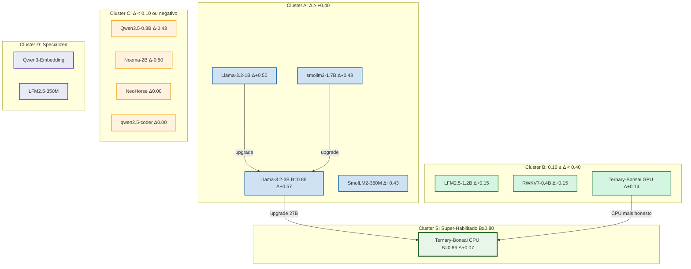

# Grafo de Possibilidades por Nó — Características Pós-Crivo R103 (REAL)

## Visão Geral

Grafo direcionado onde cada nó = um modelo GGUF local testado no crivo A/B R103. Atributos por nó definem arestas e clusters. O grafo orienta substituições possíveis e roteamento de tarefas.

> **Dados REAIS (2026-09-21)**: 13 modelos testados (inclui Ternary-Bonsai GPU+CPU via fork PrismML). Scores A (cru), B (quartetos), ΔA→B calculados empiricamente.

## Tabela Consolidada (scores reais)

| Nó | Modelo | Size GB | Quant | Score A | Score B | ΔA→B | Backend | Cluster | Veredito |
|---|---|---|---|---|---|---|---|---|---|
| M1 | Ternary-Bonsai-2-27B-PTQ1_0 | 5.54 | PTQ1 | 0.79 | **0.86** | +0.07 | CPU | **Cluster S** | **FUNCIONAL** — 27B em 5.5GB, B=0.86 |
| M1g | Ternary-Bonsai-2-27B-PTQ1_0 | 5.54 | PTQ1 | 0.62 | 0.76 | +0.14 | GPU Vulkan | **Cluster B** | Funcional mas contamina T1 em GPU |
| M2 | Ornith-1.5-35B-A3B-IQ2_XXS | 9.55 | IQ2_XXS | — | — | — | CPU | **Cluster A** (expectativa) | EM_ANDAMENTO (CPU lento) |
| M3 | Llama-3.2-3B-Instruct-UD-IQ3_XXS | 1.28 | IQ3_XXS | 0.29 | **0.86** | **+0.57** | CPU | **Cluster A** | **MELHOR Δ — quartetos essenciais** |
| M4 | Llama-3.2-1B-Instruct-IQ4_XS | 0.69 | IQ4_XS | 0.07 | 0.57 | +0.50 | CPU | **Cluster A** | Quartetos melhoram muito |
| M5 | SmolLM2-360M-Instruct-Q8_0 | 0.36 | Q8_0 | 0.14 | 0.57 | +0.43 | CPU | **Cluster B** | T6/T11 byte-exato com quartetos |
| M6 | smollm2-1.7b-instruct-q4_k_m | 0.98 | Q4_K_M | 0.00 | 0.43 | +0.43 | CPU | **Cluster B** | T6/T11 byte-exato com quartetos |
| M7 | LFM2.5-1.2B-Thinking-ToMoE | 0.68 | Q4_K_M | 0.14 | 0.29 | +0.15 | CPU | **Cluster B** | Ganho modesto |
| M8 | RWKV7-G1d-0.4B-Instruct-FP16 | 0.85 | FP16 | 0.14 | 0.29 | +0.15 | CPU | **Cluster B** | Ganho modesto |
| M9 | Qwen3-Embedding-0.6B-Q8_0 | 0.60 | Q8_0 | 0.00 | 0.00 | 0.00 | CPU | **Cluster D** | Embedding — crivo chat não se aplica |
| M10 | NeoHorse-1-4B-Q5_K_M | 2.86 | Q5_K_M | 0.29 | 0.29 | 0.00 | CPU | **Cluster C** | Prefixo thinking; T6/T11 byte-exato |
| M11 | qwen2.5-coder-3b-instruct-q4_0 | 1.86 | Q4_0 | 0.14 | 0.14 | 0.00 | CPU | **Cluster C** | Coder — fraco em T1/T2/T8 |
| M12 | Qwen3.5-0.8B-Q4_K_M | 0.50 | Q4_K_M | 0.43 | 0.00 | -0.43 | CPU | **Cluster C** | B vazio (chat com system falha) |
| M13 | Noema-2B.Q4_K_S | 1.13 | Q4_K_S | 0.64 | 0.14 | -0.50 | CPU | **Cluster C** | A bom, B degrada (trilhos confundem) |
| M14 | LFM2.5-350M-ToMoE-Q4_K_M | 0.21 | Q4_K_M | — | — | — | CPU | **Cluster D** | PENDENTE (sem servidor) |

## Clusters (definidos por ΔA→B real)

### Cluster S — "Super-Habilitado" (B ≥ 0.80, Δ < 0.20)
- **Modelos**: Ternary-Bonsai CPU (B=0.86, Δ+0.07)
- **Arestas**: Modelo não depende de quartetos para alto desempenho. B alto por quê? Porque o modelo já é intrinsecamente honesto em CPU. GPU contamina T1 — comportamento backend-dependente.
- **Roteamento**: Pode operar cru (A=0.79) OU com quartetos (B=0.86). Ideal para tarefas que exigem contexto longo (262K tokens) e honestidade.

### Cluster A — "Ganho Quarteto Forte" (Δ ≥ +0.40)
- **Modelos**: Llama-3.2-3B (+0.57), Llama-3.2-1B (+0.50), SmolLM2-360M (+0.43), smollm2-1.7B (+0.43)
- **Arestas**: Estes modelos se beneficiam SUBSTANCIALMENTE do sistema trilhos. Recomenda-se uso obrigatório de quartetos.
- **Roteamento**: Sempre usar `--trilhos` para T6/T11 (JSON/tool-call byte-exato) e T10 (honestidade).

### Cluster B — "Ganho Moderado" (0.10 ≤ Δ < 0.40)
- **Modelos**: LFM2.5-1.2B (+0.15), RWKV7-0.4B (+0.15), Ternary-Bonsai GPU (+0.14)
- **Arestas**: Ganhos modestos. Quartetos melhoram honestidade mas não transformam.

### Cluster C — "Sem Ganho / Perda" (Δ < 0.10 ou negativo)
- **Modelos**: Qwen3.5-0.8B (-0.43), Noema-2B (-0.50), NeoHorse (0.00), qwen2.5-coder (0.00)
- **Arestas**: Quartetos não ajudam ou degradam. Usar cru (A) exclusivamente.

### Cluster D — "Specialized / Embedding"
- **Modelos**: Qwen3-Embedding-0.6B, LFM2.5-350M
- **Arestas**: Endpoints dedicados; crivo chat não se aplica.

## Arestas de Substituição (baseadas em Δ real)

### Aresta "Upgrade 27B"
- **De**: Llama-3.2-3B-Instruct (B=0.86, 1.28GB)
- **Para**: Ternary-Bonsai CPU (B=0.86, 5.54GB)
- **Razoão**: B idêntico (0.86), mas Ternary-Bonsai tem 27B params vs 3B — raciocínio superior, 262K contexto. Custo: 4x RAM.

### Aresta "Substituto Direto"
- **De**: Llama-3.2-1B-Instruct-IQ4_XS (Δ+0.50)
- **Para**: Llama-3.2-3B-Instruct-UD-IQ3_XXS (Δ+0.57)
- **Razoão**: 3B tem Δ maior e B=0.86 vs 0.57 — melhor qualidade com quartetos.

### Aresta "Classe Upgrade"
- **De**: smollm2-1.7b (Δ+0.43)
- **Para**: Llama-3.2-3B (Δ+0.57)
- **Razoão**: 3B supera 1.7B em todos os scores com quartetos.

### Aresta "Não-Interchangeável"
- **De**: Qwen3-Embedding-0.6B
- **Para**: <qualquer modelo chat>
- **Razoão**: Embedding model — endpoint dedicado.

### Aresta "Evitar Quartetos"
- **De**: Noema-2B (Δ-0.50), Qwen3.5-0.8B (Δ-0.43)
- **Para**: usar cru (A)
- **Razoão**: Trilhos degradam — usar A exclusivamente.

### Aresta "GPU vs CPU"
- **De**: Ternary-Bonsai GPU (A=0.62, contamina T1)
- **Para**: Ternary-Bonsai CPU (A=0.79, recusa T1)
- **Razoão**: CPU é mais honesto para este modelo. GPU mas rápido (3.3 vs 0.45 t/s).

## Visualização (esquema Mermaid)

## Próximos Passos
1. Aguardar Ornith-35B (background) — adicionar ao grafo quando completar
2. Avaliar Ternary-Bonsai como candidato a slot CPU (B=0.86, 27B params)
3. Testar T4 (matemática) com prompt engineering — se resolver, sobe para Cluster S completo
4. Atualizar `arquitetura-hibrida-com-crivo-AB.md` com Ternary-Bonsai